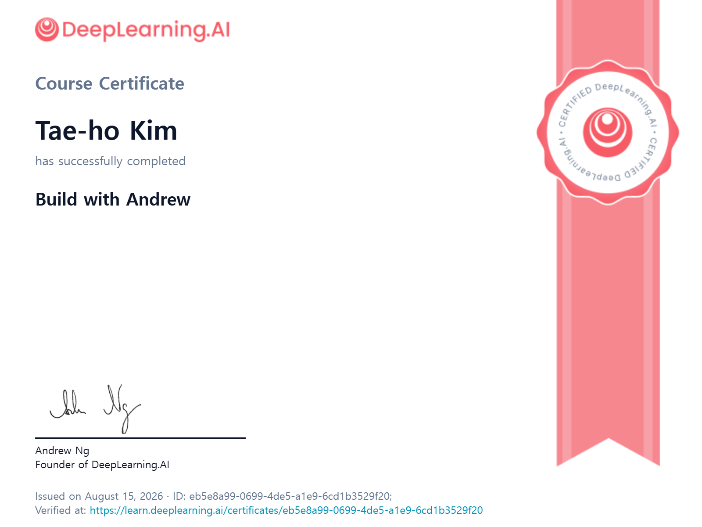
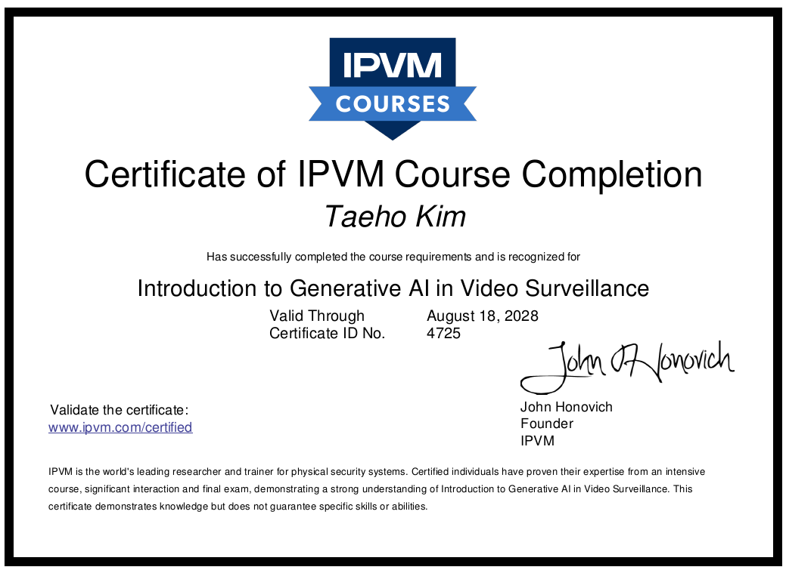
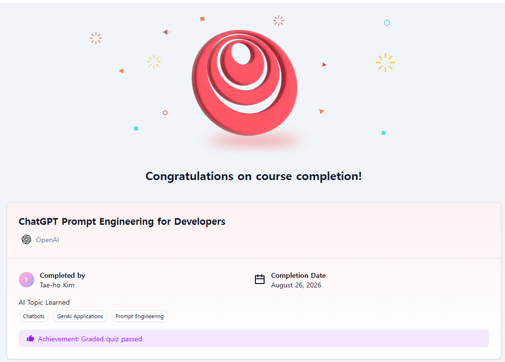

# Achievements of the August, 2026

* Kaggle (Certificate of Completion)

  * Pandas (on August 1, 2026)

    

* Deeplearning.AI (Certificate of Completion, https://www.deeplearning.ai/)

  * Build with Andrew (on August 15, 2026)

    

  
  
* IPVM AI 101 Course (Certification of IPVM Course Completion)

  * Introduction to Generative AI in Video Surveillance (on August 18, 2026)
  

* Deeplearning.AI (Completion of short course, https://www.deeplearning.ai/)

  * ChatGPT Prompt Engineering for Developers  (on August 26, 2026)

    

  

​        