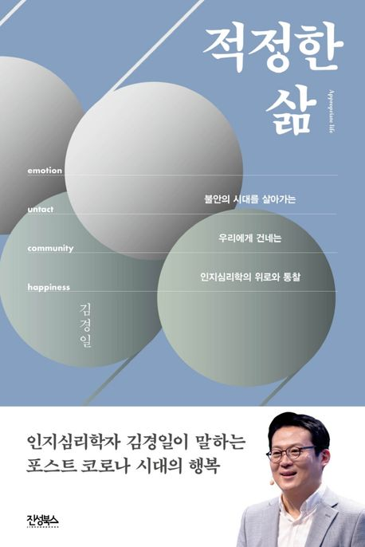

# Todays

### Main Activities

* #### **Tokenizer**
  
  1) Build a Large Language Model From Scratch
      https://wikidocs.net/253976
  
  2) 딥러닝을 이용한 자연어 처리 입문
      https://wikidocs.net/book/2155

  
  
* #### Transformers

  * Approaching to Transformers via the huggingface model

    [transformers/i18n/README_ko.md at main · huggingface/transformers](https://github.com/huggingface/transformers/blob/main/i18n/README_ko.md)

  ​	

* #### **Word2Vec**

  1) Stanford  CS224n
      https://web.stanford.edu/class/cs224n/ 

  2) 사전 학습
      https://cs231n.github.io/python-numpy-tutorial/        

* Deep Learning with Pytorch

  

* Build a Large Language Model from Scratch (Sebastian Raschka, **Very Useful**)

  

* #### **Transformers in Hugging Face**

  https://huggingface.co/docs/transformers/index
  
  ​    

### CUE

- Python DataAccessing

  https://wesmckinney.com/book/accessing-data 

- #### **TensorZero**

- #### **Tulu of the Allen institute** 

- #### **Open-instruct**
  
  https://github.com/HoTaeWang/open-instruct
  
- #### Building Generative AI application with Gradio

  https://www.deeplearning.ai/short-courses/building-generative-ai-applications-with-gradio/ 

### Reading Books

* Appropriate Life

  

  

