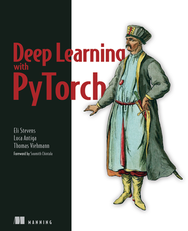
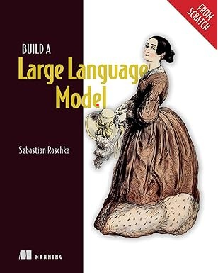
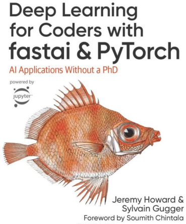

# Todays

### Main Activities

#### **Tokenizer**

  1) Build a Large Language Model From Scratch
      https://wikidocs.net/253976

  2) 딥러닝을 이용한 자연어 처리 입문
      https://wikidocs.net/book/2155

  3) Practical Deep Learning for Coders
      https://course.fast.ai/Resources/book.html

#### **AI Engineering**

* Chip Huan AI Engineering

  https://github.com/chiphuyen/aie-book

#### Transformers

  * Approaching to Transformers via the huggingface model

    [transformers/i18n/README_ko.md at main huggingface/transformers](https://github.com/huggingface/transformers/blob/main/i18n/README_ko.md)

#### **Word2Vec**

  1) Stanford  CS224n
      https://web.stanford.edu/class/cs224n/ 

  2) 사전 학습
      https://cs231n.github.io/python-numpy-tutorial/        

#### Deep Learning with Pytorch

  

#### Build a Large Language Model from Scratch (Sebastian Raschka, **Very Useful**)

  

#### Deep Learning for Coders with fastai & PyTorch

  

#### **Transformers in Hugging Face**

  https://huggingface.co/docs/transformers/index

### S 

* **Frigate** 

  https://github.com/blakeblackshear/frigate

### CUE

- **Python Data Accessing**

  https://wesmckinney.com/book/accessing-data 

- **Jupyter nbviewer**

  https://nbviewer.org/ 

- **MDPI**(Multidisciplinary Digital Publishing Institute) 
  https://www.mdpi.com 

- **TensorZero**

- **Tulu of the Allen institute** 

- **Open-instruct**
  
  https://github.com/HoTaeWang/open-instruct

### Reading Books

**AI Engineering**

  

  

