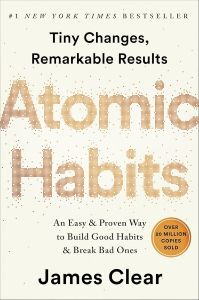

# Todays

### Main Activities

* **Tokenizer**
  
  1) Build a Large Language Model From Scratch
      https://wikidocs.net/253976
  
  2) 딥러닝을 이용한 자연어 처리 입문
      https://wikidocs.net/book/2155

  	
* **Word2Vec**

  1) Stanford  CS224n
      https://web.stanford.edu/class/cs224n/ 

  2) 사전 학습
      https://cs231n.github.io/python-numpy-tutorial/        

  

* **Transformers in Hugging Face**
    https://huggingface.co/docs/transformers/index

    

### CUE

- **TensorZero**
- **Tulu of the Allen institute** 
- **Open-instruct**
  https://github.com/HoTaeWang/open-instruct

### Reading Books

*  Atomic Habit

  

* Nexus

